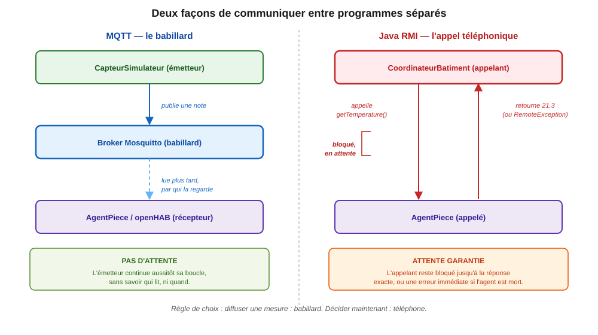
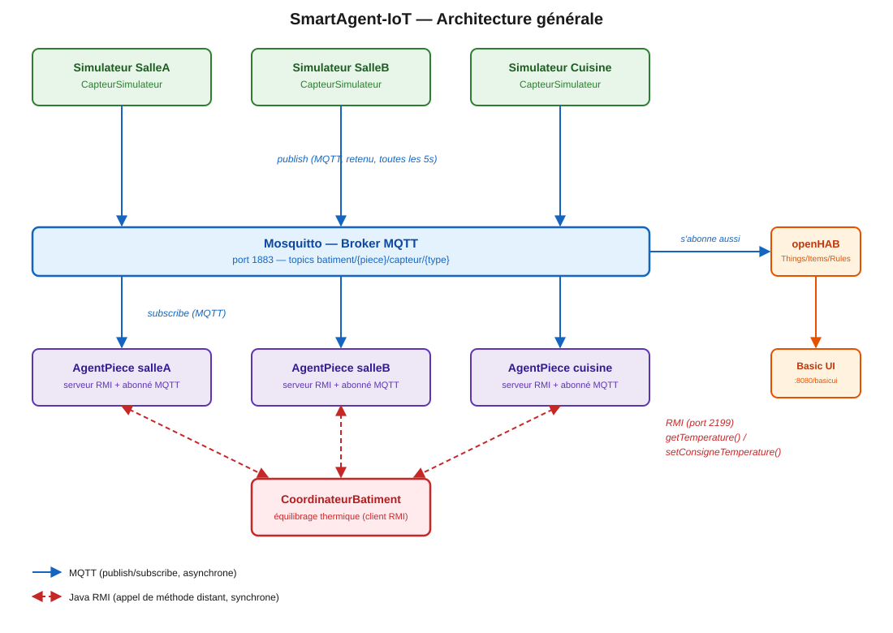

# Guide d'implémentation — SmartAgent-IoT

Ce guide permet de reconstruire tout le projet **à la main, de zéro, sur une machine neuve**, sans avoir à redécouvrir les pièges déjà rencontrés pendant le développement. Le code donné ici est la version **finale et corrigée** (pas notre parcours réel, qui a contenu plusieurs bugs — ils sont documentés en encadré "⚠ Piège" à l'endroit où on les aurait rencontrés, pour comprendre pourquoi le code est écrit ainsi).

Chaque section correspond à une tâche de l'énoncé du projet (IFT605/IFT713, SmartAgent-IoT). Suivre l'ordre : chaque étape dépend de la précédente.

---

# Partie A — Comprendre les outils avant de coder 

Cette partie explique **pourquoi** chaque outil existe et **ce qu'il fait vraiment**, avec des images simples, avant de plonger dans le code (Partie B). Si tu es à l'aise avec les concepts de systèmes répartis, tu peux sauter directement à la Partie B.

## A.1 Le problème de base : des programmes séparés qui doivent se parler

Dans ce projet, plusieurs programmes tournent dans des processus complètement séparés (parfois même dans des JVM différentes, parfois dans des conteneurs Docker différents) : les simulateurs de capteurs, les 3 agents de pièce, le coordinateur, et openHAB. Aucun ne partage de mémoire avec un autre — un agent ne peut pas juste "lire une variable" d'un autre programme. Le **seul** moyen de communiquer est d'envoyer des messages sur le réseau.

Il y a deux façons fondamentalement différentes de le faire, et le projet utilise **les deux**, chacune là où elle est la bonne réponse.

### Image 1 — le babillard (MQTT)

Tu épingles une note sur un babillard dans un couloir. Tu ne sais pas qui va la lire, ni quand. Tu n'attends aucune réponse : tu continues ta journée immédiatement après avoir épinglé la note. Les gens qui passent devant le babillard la lisent à leur rythme, ou pas du tout si personne ne regarde — et ça ne bloque jamais la personne qui a écrit la note.

**Conséquence directe sur le code** : `CapteurSimulateur` publie une mesure toutes les 5 secondes et repart immédiatement dormir (`Thread.sleep(5000)`), sans se soucier de savoir si un agent, openHAB, ou personne du tout est en train d'écouter à cet instant.

### Image 2 — l'appel téléphonique (RMI)

Tu composes le numéro d'une personne précise. Tu poses ta question. Tu **restes en ligne**, à attendre sa réponse exacte, avant de raccrocher et de continuer. Si la ligne ne répond pas, tu es bloqué à attendre, ou l'appel échoue franchement (occupé, pas de réseau).

**Pourquoi le coordinateur a besoin de ça et pas du babillard** : il doit décider **maintenant, tout de suite** s'il ajuste un thermostat, en comparant la température actuelle de deux pièces. S'il utilisait le babillard comme tout le monde, il n'aurait accès qu'à la dernière note épinglée — vieille d'au plus 5 secondes, mais potentiellement aussi vieille que ça, sans garantie. Il devrait en plus s'abonner en permanence et garder sa propre copie de la dernière valeur de chaque pièce, sans jamais être certain qu'elle est fraîche à l'instant où il compare. Avec RMI, il **appelle directement** `agentSalleA.getTemperature()` et reçoit la valeur vraiment actuelle en mémoire chez l'agent, comme s'il appelait une méthode locale — et si l'agent est mort, il le sait tout de suite (`RemoteException`) plutôt que de deviner pourquoi aucune note récente n'est apparue.

**Résumé de la règle de choix** : si tu n'as pas besoin d'une réponse précise à un instant précis (diffuser une mesure), utilise le babillard. Si tu as besoin d'une réponse garantie fraîche pour prendre une décision immédiate (interroger un agent), utilise l'appel téléphonique.



## A.2 MQTT en détail : le babillard a besoin d'un gérant, et les notes ont des étiquettes

Un vrai babillard, ce n'est pas juste un mur : il faut quelqu'un qui gère physiquement l'endroit, reçoit les notes et les distribue à qui les demande. C'est le rôle du **broker MQTT** — dans ce projet, **Eclipse Mosquitto**. Les capteurs et les agents ne se parlent **jamais directement** ; ils passent tous par Mosquitto.

Sur ce babillard, il n'y a pas une seule note qui circule, mais 9 flux différents en même temps (3 pièces × température/luminosité/occupation). Pour trier sans avoir à tout lire, chaque note porte une étiquette hiérarchique appelée **topic**, écrite comme un chemin de dossiers :

```
batiment/{piece}/capteur/{type}
```

Par exemple `batiment/cuisine/capteur/temperature` = section "cuisine", sous-section "température".

Un abonné peut aussi utiliser un **joker** (`#`) pour attraper toute une section d'un coup au lieu de s'abonner une note à la fois :

```java
mqttClient.subscribe("batiment/cuisine/capteur/#", ...);
```

Ceci attrape température, luminosité ET occupation de la cuisine en un seul abonnement — et si on ajoutait un 4e capteur demain, le code n'aurait même pas besoin de changer.

Deux derniers détails de comportement à retenir :

- **`retained=true`** : le broker garde la dernière valeur de chaque topic en mémoire. Un nouvel abonné (ex. un agent qui redémarre, ou openHAB qui démarre après les capteurs) reçoit **immédiatement** la dernière note connue au lieu d'attendre jusqu'à 5 secondes le prochain cycle.
- **QoS (Quality of Service)** : le niveau de garantie de livraison. QoS 0 ("au plus une fois") pour les mesures de capteurs — en perdre une occasionnellement n'est pas grave puisqu'une nouvelle arrive 5 secondes plus tard. QoS 1 ("au moins une fois") pour les commandes d'actuateur (`setConsigneTemperature`) — une commande ne doit pas se perdre silencieusement.

## A.3 Docker et Docker Compose : des appartements préfabriqués

Mosquitto et openHAB sont des logiciels complexes, avec leurs propres dépendances système. Les installer "à la main" sur la machine (comme n'importe quel autre programme) risquerait d'entrer en conflit avec d'autres logiciels déjà installés, et ne se comporterait pas forcément pareil sur la machine d'un coéquipier.

**Image** : un conteneur Docker est comme un appartement préfabriqué, construit en usine avec absolument tout ce dont il a besoin à l'intérieur (plomberie, électricité, meubles), livré et branché sur le terrain sans rien avoir à installer manuellement sur place. Peu importe le terrain (la machine hôte), l'appartement fonctionne identiquement.

**Docker Compose** est le plan de lotissement : un seul fichier (`docker-compose.yml`) qui décrit plusieurs appartements à construire ensemble (ici : Mosquitto + openHAB) et comment ils sont connectés au même réseau, pour ne pas avoir à taper une longue commande `docker run` différente pour chacun.

## A.4 openHAB : la salle de contrôle qui regarde le même babillard

openHAB ne fait pas partie de la conversation MQTT/RMI entre agents — c'est un **troisième observateur** qui s'abonne lui aussi au babillard Mosquitto (exactement comme un agent le ferait), mais dans le but d'offrir un panneau de contrôle lisible par un humain plutôt que de prendre des décisions automatiques comme le coordinateur.

Quatre couches, de la prise électrique brute jusqu'à l'écran :

| Couche            | Rôle                                                              | Image                                                                                    |
| ----------------- | ------------------------------------------------------------------ | ---------------------------------------------------------------------------------------- |
| **Thing**   | La connexion physique/réseau (le fil qui sort du mur)             | La prise électrique                                                                     |
| **Item**    | Une variable nommée et affichable, liée à un canal du Thing     | L'ampoule branchée sur la prise, avec une étiquette "Lampe du salon"                   |
| **Rule**    | Un réflexe automatique ("si X alors Y"), écrit en DSL            | Une minuterie qui éteint la lampe à 23h                                                |
| **Sitemap** | La disposition visuelle du panneau de contrôle dans le navigateur | Le plan du panneau électrique, avec chaque interrupteur étiqueté et rangé par pièce |

Sans **Item**, un Thing existe mais n'a aucun nom affichable. Sans **Sitemap** (ou sans construire manuellement des pages dans la "Main UI"), même avec des Items bien configurés, l'écran reste vide — ce qui explique exactement le problème qu'on a eu (voir Section 12, piège #8) : les données arrivaient bien jusqu'à openHAB, mais rien n'était disposé à l'écran pour les montrer.

## A.5 Maven multi-module : une usine avec plusieurs ateliers spécialisés

Le projet a 3 responsabilités très différentes (simuler des capteurs, faire tourner un agent RMI, coordonner). Plutôt que tout mettre dans un seul gros programme, Maven permet de les séparer en **modules** indépendants qui se compilent ensemble.

**Image** : une usine avec 3 ateliers (`sensor-simulator`, `agent-piece`, `coordinateur`), chacun avec son propre plan de fabrication (`pom.xml`), mais tous les 3 partagent un même livre de spécifications communes (le `pom.xml` **parent**) qui fixe une seule fois les versions des pièces utilisées (Paho, JSON, JUnit) — pour que les 3 ateliers utilisent exactement les mêmes pièces sans avoir à le répéter partout.

À la fin, le **maven-shade-plugin** joue le rôle de la chaîne d'emballage finale : il prend tout ce dont un atelier a besoin pour fonctionner (le code + toutes ses dépendances) et l'emballe dans une seule boîte à outils autonome (`agent-piece.jar`), utilisable n'importe où avec une seule commande (`java -jar agent-piece.jar salleA`), sans avoir à gérer un classpath compliqué.

Le module `coordinateur` ne dépend du module `agent-piece` que pour récupérer **l'interface** `IAgentPiece` (le plan de la prise téléphonique, pas l'appareil lui-même) — depuis Java 5, RMI génère les stubs (les "combinés téléphoniques" côté appelant) automatiquement à partir de l'interface seule.

## A.6 Comment tout ça s'articule ensemble

```
CapteurSimulateur  --publie (babillard, MQTT)-->  Mosquitto  <--s'abonne (babillard)--  AgentPiece
                                                       ^
                                                       |
                                          s'abonne (babillard) aussi
                                                       |
                                                    openHAB  --affiche--> Sitemap (navigateur)

CoordinateurBatiment  --appelle (téléphone, RMI)-->  AgentPiece.getTemperature()
```

Le `AgentPiece` est le seul composant qui parle **les deux langages** : il écoute le babillard (MQTT, pour connaître l'état de sa pièce) et répond au téléphone (RMI, quand le coordinateur ou un client de test l'appelle). C'est le pont entre les deux mondes.

Version illustrée du même schéma, avec les ports et les types de flèches (source : `diagrams/architecture.svg`, aussi utilisée comme Figure 1 du rapport) :



---

## 0. Vue d'ensemble

Trois technologies, trois rôles :

| Techno           | Rôle                     | Modèle de communication                 |
| ---------------- | ------------------------- | ---------------------------------------- |
| MQTT (Mosquitto) | Capteurs → agents        | Publish/subscribe asynchrone, découplé |
| Java RMI         | Agents ↔ coordinateur    | Appel de méthode distant, synchrone     |
| openHAB 4        | Tableau de bord + règles | Consomme les mêmes flux MQTT            |

Structure finale du dépôt :

```
smartagent-iot/
├── pom.xml                              (parent Maven)
├── docker-compose.yml                   (Mosquitto + openHAB)
├── .gitignore
├── mosquitto/config/mosquitto.conf
├── openhab/conf/
│   ├── things/batiment.things
│   ├── items/batiment.items
│   ├── rules/batiment.rules
│   ├── sitemaps/batiment.sitemap
│   └── services/addons.cfg
├── sensor-simulator/
│   ├── pom.xml
│   └── src/main/java/ca/udes/ift605/smartagent/sensor/
│       ├── CapteurSimulateur.java
│       └── SensorSimulatorMain.java
├── agent-piece/
│   ├── pom.xml
│   └── src/main/java/ca/udes/ift605/smartagent/agent/
│       ├── IAgentPiece.java
│       ├── AgentPiece.java
│       ├── AgentPieceMain.java
│       └── AgentPieceTestClient.java
└── coordinateur/
    ├── pom.xml
    └── src/
        ├── main/java/ca/udes/ift605/smartagent/coordinateur/
        │   ├── CoordinateurBatiment.java
        │   └── CoordinateurMain.java
        └── test/java/ca/udes/ift605/smartagent/coordinateur/
            ├── FauxAgentPiece.java
            └── CoordinateurBatimentTest.java
```

---

## 1. Prérequis et installation de l'environnement

Sur une machine Ubuntu/Debian neuve :

```bash
sudo apt update
sudo apt install -y docker.io docker-compose-v2 openjdk-21-jdk maven mosquitto-clients
sudo usermod -aG docker $USER
```

> ⚠ **Piège** : `usermod -aG docker` n'active le nouveau groupe que pour une **nouvelle** session de connexion. Un terminal déjà ouvert (ou une session SSH déjà active) ne le voit pas tant qu'on ne se déconnecte/reconnecte pas (ou qu'on ne redémarre pas la machine). `newgrp docker` peut dépanner ponctuellement mais nécessite le paquet `util-linux-extra` sur certaines distributions.

Vérifier l'installation :

```bash
java -version    # doit afficher 21.x
mvn -version
docker --version
docker compose version
```

---

## 2. Structure du projet Maven multi-module

Un projet **multi-module** Maven = un `pom.xml` racine de type `pom` (aucun code, juste de la configuration partagée) qui liste des sous-modules, chacun avec son propre `pom.xml`.

Créer l'arborescence :

```bash
mkdir -p smartagent-iot/{mosquitto/config,openhab/{conf/{things,items,rules,sitemaps,services},userdata,addons}}
mkdir -p smartagent-iot/sensor-simulator/src/main/java/ca/udes/ift605/smartagent/sensor
mkdir -p smartagent-iot/agent-piece/src/main/java/ca/udes/ift605/smartagent/agent
mkdir -p smartagent-iot/coordinateur/src/main/java/ca/udes/ift605/smartagent/coordinateur
mkdir -p smartagent-iot/coordinateur/src/test/java/ca/udes/ift605/smartagent/coordinateur
cd smartagent-iot
```

### 2.1 `pom.xml` (parent)

Rôle : centraliser les **versions** des dépendances (dans `dependencyManagement`) pour que chaque module les redéclare sans version, et fixer la version de Java (21) une seule fois.

```xml
<?xml version="1.0" encoding="UTF-8"?>
<project xmlns="http://maven.apache.org/POM/4.0.0"
         xmlns:xsi="http://www.w3.org/2001/XMLSchema-instance"
         xsi:schemaLocation="http://maven.apache.org/POM/4.0.0 http://maven.apache.org/xsd/maven-4.0.0.xsd">
    <modelVersion>4.0.0</modelVersion>

    <groupId>ca.udes.ift605</groupId>
    <artifactId>smartagent-iot-parent</artifactId>
    <version>1.0.0</version>
    <packaging>pom</packaging>
    <name>SmartAgent-IoT (parent)</name>

    <modules>
        <module>sensor-simulator</module>
        <module>agent-piece</module>
        <module>coordinateur</module>
    </modules>

    <properties>
        <project.build.sourceEncoding>UTF-8</project.build.sourceEncoding>
        <maven.compiler.release>21</maven.compiler.release>
        <paho.version>1.2.5</paho.version>
        <json.version>20240303</json.version>
        <junit.version>5.10.2</junit.version>
    </properties>

    <dependencyManagement>
        <dependencies>
            <dependency>
                <groupId>org.eclipse.paho</groupId>
                <artifactId>org.eclipse.paho.client.mqttv3</artifactId>
                <version>${paho.version}</version>
            </dependency>
            <dependency>
                <groupId>org.json</groupId>
                <artifactId>json</artifactId>
                <version>${json.version}</version>
            </dependency>
            <dependency>
                <groupId>org.junit.jupiter</groupId>
                <artifactId>junit-jupiter</artifactId>
                <version>${junit.version}</version>
                <scope>test</scope>
            </dependency>
        </dependencies>
    </dependencyManagement>

    <build>
        <pluginManagement>
            <plugins>
                <plugin>
                    <groupId>org.apache.maven.plugins</groupId>
                    <artifactId>maven-surefire-plugin</artifactId>
                    <version>3.2.5</version>
                </plugin>
            </plugins>
        </pluginManagement>
    </build>
</project>
```

### 2.2 `sensor-simulator/pom.xml`

Dépend uniquement de Paho (client MQTT) : ce module ignore tout du RMI, exactement comme un vrai capteur ignorerait qui consomme ses données.

```xml
<?xml version="1.0" encoding="UTF-8"?>
<project xmlns="http://maven.apache.org/POM/4.0.0"
         xmlns:xsi="http://www.w3.org/2001/XMLSchema-instance"
         xsi:schemaLocation="http://maven.apache.org/POM/4.0.0 http://maven.apache.org/xsd/maven-4.0.0.xsd">
    <modelVersion>4.0.0</modelVersion>
    <parent>
        <groupId>ca.udes.ift605</groupId>
        <artifactId>smartagent-iot-parent</artifactId>
        <version>1.0.0</version>
    </parent>
    <artifactId>sensor-simulator</artifactId>
    <name>SmartAgent-IoT :: Sensor Simulator</name>

    <dependencies>
        <dependency>
            <groupId>org.eclipse.paho</groupId>
            <artifactId>org.eclipse.paho.client.mqttv3</artifactId>
        </dependency>
        <dependency>
            <groupId>org.junit.jupiter</groupId>
            <artifactId>junit-jupiter</artifactId>
            <scope>test</scope>
        </dependency>
    </dependencies>

    <build>
        <finalName>sensor-simulator</finalName>
        <plugins>
            <plugin>
                <groupId>org.apache.maven.plugins</groupId>
                <artifactId>maven-shade-plugin</artifactId>
                <version>3.5.1</version>
                <executions>
                    <execution>
                        <phase>package</phase>
                        <goals><goal>shade</goal></goals>
                        <configuration>
                            <transformers>
                                <transformer implementation="org.apache.maven.plugins.shade.resource.ManifestResourceTransformer">
                                    <mainClass>ca.udes.ift605.smartagent.sensor.SensorSimulatorMain</mainClass>
                                </transformer>
                            </transformers>
                        </configuration>
                    </execution>
                </executions>
            </plugin>
        </plugins>
    </build>
</project>
```

Le `maven-shade-plugin` produit un **jar exécutable autonome** ("fat jar", toutes les dépendances incluses) — utile pour lancer `java -jar sensor-simulator.jar` directement, sans classpath à gérer.

### 2.3 `agent-piece/pom.xml`

Dépend de Paho (MQTT) et `org.json` (pour `getEtatJson()`). RMI lui-même ne demande **aucune** dépendance externe : `java.rmi.*` fait partie du JDK.

```xml
<?xml version="1.0" encoding="UTF-8"?>
<project xmlns="http://maven.apache.org/POM/4.0.0"
         xmlns:xsi="http://www.w3.org/2001/XMLSchema-instance"
         xsi:schemaLocation="http://maven.apache.org/POM/4.0.0 http://maven.apache.org/xsd/maven-4.0.0.xsd">
    <modelVersion>4.0.0</modelVersion>
    <parent>
        <groupId>ca.udes.ift605</groupId>
        <artifactId>smartagent-iot-parent</artifactId>
        <version>1.0.0</version>
    </parent>
    <artifactId>agent-piece</artifactId>
    <name>SmartAgent-IoT :: Agent Piece (RMI + MQTT)</name>

    <dependencies>
        <dependency>
            <groupId>org.eclipse.paho</groupId>
            <artifactId>org.eclipse.paho.client.mqttv3</artifactId>
        </dependency>
        <dependency>
            <groupId>org.json</groupId>
            <artifactId>json</artifactId>
        </dependency>
        <dependency>
            <groupId>org.junit.jupiter</groupId>
            <artifactId>junit-jupiter</artifactId>
            <scope>test</scope>
        </dependency>
    </dependencies>

    <build>
        <finalName>agent-piece</finalName>
        <plugins>
            <plugin>
                <groupId>org.apache.maven.plugins</groupId>
                <artifactId>maven-shade-plugin</artifactId>
                <version>3.5.1</version>
                <executions>
                    <execution>
                        <phase>package</phase>
                        <goals><goal>shade</goal></goals>
                        <configuration>
                            <transformers>
                                <transformer implementation="org.apache.maven.plugins.shade.resource.ManifestResourceTransformer">
                                    <mainClass>ca.udes.ift605.smartagent.agent.AgentPieceMain</mainClass>
                                </transformer>
                            </transformers>
                        </configuration>
                    </execution>
                </executions>
            </plugin>
        </plugins>
    </build>
</project>
```

### 2.4 `coordinateur/pom.xml`

Dépend du module `agent-piece` **uniquement** pour récupérer la classe `IAgentPiece` (l'interface). Depuis Java 5, RMI génère les stubs dynamiquement : un client RMI n'a jamais besoin de la classe d'implémentation distante (`AgentPiece`), seulement de l'interface.

```xml
<?xml version="1.0" encoding="UTF-8"?>
<project xmlns="http://maven.apache.org/POM/4.0.0"
         xmlns:xsi="http://www.w3.org/2001/XMLSchema-instance"
         xsi:schemaLocation="http://maven.apache.org/POM/4.0.0 http://maven.apache.org/xsd/maven-4.0.0.xsd">
    <modelVersion>4.0.0</modelVersion>
    <parent>
        <groupId>ca.udes.ift605</groupId>
        <artifactId>smartagent-iot-parent</artifactId>
        <version>1.0.0</version>
    </parent>
    <artifactId>coordinateur</artifactId>
    <name>SmartAgent-IoT :: Coordinateur Batiment</name>

    <dependencies>
        <dependency>
            <groupId>ca.udes.ift605</groupId>
            <artifactId>agent-piece</artifactId>
            <version>${project.version}</version>
        </dependency>
        <dependency>
            <groupId>org.junit.jupiter</groupId>
            <artifactId>junit-jupiter</artifactId>
            <scope>test</scope>
        </dependency>
    </dependencies>

    <build>
        <finalName>coordinateur</finalName>
        <plugins>
            <plugin>
                <groupId>org.apache.maven.plugins</groupId>
                <artifactId>maven-shade-plugin</artifactId>
                <version>3.5.1</version>
                <executions>
                    <execution>
                        <phase>package</phase>
                        <goals><goal>shade</goal></goals>
                        <configuration>
                            <transformers>
                                <transformer implementation="org.apache.maven.plugins.shade.resource.ManifestResourceTransformer">
                                    <mainClass>ca.udes.ift605.smartagent.coordinateur.CoordinateurMain</mainClass>
                                </transformer>
                            </transformers>
                        </configuration>
                    </execution>
                </executions>
            </plugin>
        </plugins>
    </build>
</project>
```

### 2.5 `.gitignore`

```gitignore
target/
*.class
openhab/userdata/
openhab/addons/*
!openhab/addons/.gitkeep
*.log
.idea/
*.iml
.vscode/
.classpath
.project
.settings/
.DS_Store
```

---

## 3. Infrastructure Docker (Mosquitto + openHAB)

### 3.1 `mosquitto/config/mosquitto.conf`

```conf
listener 1883
allow_anonymous true

persistence true
persistence_location /mosquitto/data/

log_dest file /mosquitto/log/mosquitto.log
log_dest stdout
log_timestamp true
```

`allow_anonymous true` est acceptable pour un projet local. En production, on utiliserait plutôt `password_file` + un fichier ACL par topic.

### 3.2 `docker-compose.yml`

```yaml
services:
  mosquitto:
    image: eclipse-mosquitto:2
    container_name: smartagent-mosquitto
    restart: unless-stopped
    network_mode: host
    volumes:
      - ./mosquitto/config/mosquitto.conf:/mosquitto/config/mosquitto.conf:ro
      - mosquitto-data:/mosquitto/data
      - mosquitto-log:/mosquitto/log

  openhab:
    image: openhab/openhab:4.3.11-debian
    container_name: smartagent-openhab
    restart: unless-stopped
    network_mode: host
    depends_on:
      - mosquitto
    environment:
      - OPENHAB_HTTP_PORT=8080
      - OPENHAB_HTTPS_PORT=8443
      - TZ=America/Toronto
      - CRYPTO_POLICY=unlimited
      - USER_ID=1000
      - GROUP_ID=1000
    volumes:
      - ./openhab/conf:/openhab/conf
      - ./openhab/userdata:/openhab/userdata
      - ./openhab/addons:/openhab/addons

volumes:
  mosquitto-data:
  mosquitto-log:
```

Points clés :

- **`network_mode: host`** (Linux uniquement) : permet à openHAB de joindre le broker via `localhost:1883` (exactement comme dans l'énoncé), et aux processus Java lancés hors Docker de joindre `localhost:1883` et `localhost:8080` sans configuration réseau supplémentaire.

> ⚠ **Piège** : le tag `openhab/openhab:4-debian` **n'existe plus** sur Docker Hub depuis la sortie d'openHAB 5 — seuls des tags de version précise (ex. `4.3.11-debian`) restent disponibles pour la branche 4.x. Pour connaître le dernier tag 4.x disponible : `curl -s "https://hub.docker.com/v2/repositories/openhab/openhab/tags?page_size=100" | grep -oE '"name":"4\.[0-9.]+-debian"'`.

Démarrer l'infrastructure :

```bash
docker compose up -d
docker ps    # les deux conteneurs doivent être "Up"
```

Valider Mosquitto :

```bash
mosquitto_sub -h localhost -t 'test/hello' -C 1 &
sleep 1
mosquitto_pub -h localhost -t 'test/hello' -m 'ping'
# doit afficher "ping"
```

---

## 4. Semaine 1 — Simulateurs de capteurs MQTT (Tâche 1.1)

### 4.1 `sensor-simulator/.../CapteurSimulateur.java`

```java
package ca.udes.ift605.smartagent.sensor;

import org.eclipse.paho.client.mqttv3.MqttClient;
import org.eclipse.paho.client.mqttv3.MqttConnectOptions;
import org.eclipse.paho.client.mqttv3.MqttException;
import org.eclipse.paho.client.mqttv3.MqttMessage;
import org.eclipse.paho.client.mqttv3.persist.MemoryPersistence;

import java.util.Locale;
import java.util.Random;

/**
 * Simule les trois capteurs d'une pièce (température, luminosité, occupation)
 * et publie leurs mesures sur le broker MQTT toutes les 5 secondes.
 *
 * Convention de topics (imposée par l'énoncé) :
 *   batiment/{piece}/capteur/temperature
 *   batiment/{piece}/capteur/luminosite
 *   batiment/{piece}/capteur/occupation
 *
 * Plages de valeurs réalistes documentées (à reprendre dans le rapport) :
 *   - température : 17.0 à 26.0 °C, évolution par petits pas (+-0.5°C).
 *   - luminosité   : 0 à 800 lux.
 *   - occupation   : booléen tiré avec 40% de chance d'être "occupée".
 */
public class CapteurSimulateur implements Runnable {

    private static final String BROKER_URL = "tcp://localhost:1883";
    private static final long PERIODE_MS = 5000;

    private static final double TEMP_MIN = 17.0;
    private static final double TEMP_MAX = 26.0;
    private static final int LUX_MIN = 0;
    private static final int LUX_MAX = 800;
    private static final double PROBABILITE_OCCUPATION = 0.4;

    private final String piece;
    private final MqttClient client;
    private final Random rnd = new Random();

    private double derniereTemperature;

    public CapteurSimulateur(String piece) throws MqttException {
        this.piece = piece;
        String clientId = "capteur-" + piece + "-" + System.currentTimeMillis();
        this.client = new MqttClient(BROKER_URL, clientId, new MemoryPersistence());
        this.derniereTemperature = TEMP_MIN + rnd.nextDouble() * (TEMP_MAX - TEMP_MIN);

        MqttConnectOptions options = new MqttConnectOptions();
        options.setCleanSession(true);
        options.setAutomaticReconnect(true);
        client.connect(options);
        System.out.println("[" + piece + "] connecté au broker " + BROKER_URL);
    }

    @Override
    public void run() {
        try {
            while (true) {
                // ⚠ Le catch(MqttException) est ICI, À L'INTÉRIEUR de la boucle —
                // pas autour d'elle (voir Section 12, piège #5). Une coupure
                // réseau transitoire fait échouer publish() ; capturer ici ne
                // perd qu'UN cycle de mesure au lieu de tuer le thread pour de bon.
                try {
                    publishTemp();
                    publishLuminosite();
                    publishOccupation();
                } catch (MqttException e) {
                    System.err.println("[" + piece + "] échec de publication (" + e.getMessage() +
                            "), nouvelle tentative dans " + (PERIODE_MS / 1000) + "s");
                }
                Thread.sleep(PERIODE_MS);
            }
        } catch (InterruptedException e) {
            Thread.currentThread().interrupt();
            System.out.println("[" + piece + "] simulateur arrêté");
        }
    }

    private void publishTemp() throws MqttException {
        double variation = (rnd.nextDouble() - 0.5);
        derniereTemperature = clamp(derniereTemperature + variation, TEMP_MIN, TEMP_MAX);
        publier("temperature", String.format(Locale.US, "%.1f", derniereTemperature));
    }

    private void publishLuminosite() throws MqttException {
        int lux = LUX_MIN + rnd.nextInt(LUX_MAX - LUX_MIN + 1);
        publier("luminosite", String.valueOf(lux));
    }

    private void publishOccupation() throws MqttException {
        boolean occupee = rnd.nextDouble() < PROBABILITE_OCCUPATION;
        publier("occupation", String.valueOf(occupee));
    }

    private void publier(String typeCapteur, String valeur) throws MqttException {
        String topic = "batiment/" + piece + "/capteur/" + typeCapteur;
        MqttMessage message = new MqttMessage(valeur.getBytes());
        message.setQos(0);
        message.setRetained(true); // un nouvel abonné reçoit immédiatement la dernière valeur
        client.publish(topic, message);
        System.out.printf("[%s] -> %s = %s%n", piece, topic, valeur);
    }

    private static double clamp(double v, double min, double max) {
        return Math.max(min, Math.min(max, v));
    }
}
```

### 4.2 `sensor-simulator/.../SensorSimulatorMain.java`

```java
package ca.udes.ift605.smartagent.sensor;

/**
 * Sans argument : lance les 3 pièces par défaut dans UN SEUL processus.
 * Avec un argument (ex: "salleA") : lance UNIQUEMENT cette pièce — nécessaire
 * pour pouvoir couper une seule pièce sans toucher aux deux autres (Tâche 3.1).
 */
public class SensorSimulatorMain {

    private static final String[] PIECES_PAR_DEFAUT = {"salleA", "salleB", "cuisine"};

    public static void main(String[] args) throws Exception {
        String[] pieces = args.length > 0 ? args : PIECES_PAR_DEFAUT;
        for (String piece : pieces) {
            CapteurSimulateur simulateur = new CapteurSimulateur(piece);
            Thread thread = new Thread(simulateur, "sim-" + piece);
            thread.start();
        }
        System.out.println("Simulateur(s) démarré(s) : " + String.join(", ", pieces));
        System.out.println("Ctrl+C pour arrêter.");
    }
}
```

### 4.3 Compiler et valider

```bash
mvn -pl sensor-simulator -am package -DskipTests
java -jar sensor-simulator/target/sensor-simulator.jar &

# dans un autre terminal, vérifier les 9 flux (3 pièces x 3 mesures) :
mosquitto_sub -h localhost -t 'batiment/#' -v
```

---

## 5. Semaine 1 — Configuration openHAB (Tâche 1.2)

### 5.1 `openhab/conf/services/addons.cfg`

```ini
binding = mqtt

ui = basic
```

> ⚠ **Piège** : l'identifiant Basic UI dans `addons.cfg` est `basic`, **pas** `basicui`. Pour vérifier le nom exact d'une feature openHAB, se connecter à la console Karaf du conteneur et lister les features disponibles :
>
> ```bash
> docker exec -it smartagent-openhab ./runtime/bin/client -u openhab -p habopen
> openhab> feature:list | grep -i basic
> # openhab-ui-basic  ...  -> l'identifiant court est "basic"
> ```

> ⚠ **Piège (Main UI vide)** : sans `ui = basic` **et** sans sitemap (section 5.4), la page `http://localhost:8080/` reste vide en permanence. Ce n'est pas un bug de données (l'API REST fonctionne très bien sans ça) : la "Main UI" par défaut d'openHAB 4 exige des pages construites manuellement dans le navigateur ou un modèle sémantique sur les Items, ce qu'on n'a pas ici. Basic UI + sitemap contourne complètement ce problème.

### 5.2 `openhab/conf/things/batiment.things`

```
Thing mqtt:broker:mosquitto "Broker Mosquitto" [
    host="localhost",
    port=1883,
    secure=false
]

Thing mqtt:topic:salleA "Salle A" (mqtt:broker:mosquitto) {
    Channels:
        Type number : temperature "Température"        [ stateTopic="batiment/salleA/capteur/temperature" ]
        Type number : luminosite  "Luminosité"          [ stateTopic="batiment/salleA/capteur/luminosite" ]
        Type switch : occupation  "Occupation"          [ stateTopic="batiment/salleA/capteur/occupation", on="true", off="false" ]
        Type number : thermostat  "Consigne thermostat" [ commandTopic="batiment/salleA/actuateur/thermostat", stateTopic="batiment/salleA/actuateur/thermostat" ]
}

Thing mqtt:topic:salleB "Salle B" (mqtt:broker:mosquitto) {
    Channels:
        Type number : temperature "Température"        [ stateTopic="batiment/salleB/capteur/temperature" ]
        Type number : luminosite  "Luminosité"          [ stateTopic="batiment/salleB/capteur/luminosite" ]
        Type switch : occupation  "Occupation"          [ stateTopic="batiment/salleB/capteur/occupation", on="true", off="false" ]
        Type number : thermostat  "Consigne thermostat" [ commandTopic="batiment/salleB/actuateur/thermostat", stateTopic="batiment/salleB/actuateur/thermostat" ]
}

Thing mqtt:topic:cuisine "Cuisine" (mqtt:broker:mosquitto) {
    Channels:
        Type number : temperature "Température"        [ stateTopic="batiment/cuisine/capteur/temperature" ]
        Type number : luminosite  "Luminosité"          [ stateTopic="batiment/cuisine/capteur/luminosite" ]
        Type switch : occupation  "Occupation"          [ stateTopic="batiment/cuisine/capteur/occupation", on="true", off="false" ]
        Type number : thermostat  "Consigne thermostat" [ commandTopic="batiment/cuisine/actuateur/thermostat", stateTopic="batiment/cuisine/actuateur/thermostat" ]
}
```

Un Thing `mqtt:broker` est un pont (Bridge) = la connexion réseau. Les Thing `mqtt:topic` sont enfants de ce pont et déclarent chacun 4 canaux (un par capteur/actuateur).

### 5.3 `openhab/conf/items/batiment.items`

```
Number  SalleA_Temperature  "Salle A Température [%.1f °C]"   <temperature> (gTemperature) { channel="mqtt:topic:salleA:temperature", profile="expire", expire="30s,state=UNDEF" }
Number  SalleA_Luminosite   "Salle A Luminosité [%d lux]"     <light>                       { channel="mqtt:topic:salleA:luminosite",  profile="expire", expire="30s,state=UNDEF" }
Switch  SalleA_Occupation   "Salle A Occupée"                 <presence>    (gOccupation)   { channel="mqtt:topic:salleA:occupation",  profile="expire", expire="30s,state=UNDEF" }
Number  SalleA_Thermostat   "Salle A Consigne [%.1f °C]"      <heating>                     { channel="mqtt:topic:salleA:thermostat" }

Number  SalleB_Temperature  "Salle B Température [%.1f °C]"   <temperature> (gTemperature) { channel="mqtt:topic:salleB:temperature", profile="expire", expire="30s,state=UNDEF" }
Number  SalleB_Luminosite   "Salle B Luminosité [%d lux]"     <light>                       { channel="mqtt:topic:salleB:luminosite",  profile="expire", expire="30s,state=UNDEF" }
Switch  SalleB_Occupation   "Salle B Occupée"                 <presence>    (gOccupation)   { channel="mqtt:topic:salleB:occupation",  profile="expire", expire="30s,state=UNDEF" }
Number  SalleB_Thermostat   "Salle B Consigne [%.1f °C]"      <heating>                     { channel="mqtt:topic:salleB:thermostat" }

Number  Cuisine_Temperature "Cuisine Température [%.1f °C]"   <temperature> (gTemperature) { channel="mqtt:topic:cuisine:temperature", profile="expire", expire="30s,state=UNDEF" }
Number  Cuisine_Luminosite  "Cuisine Luminosité [%d lux]"     <light>                       { channel="mqtt:topic:cuisine:luminosite",  profile="expire", expire="30s,state=UNDEF" }
Switch  Cuisine_Occupation  "Cuisine Occupée"                 <presence>    (gOccupation)   { channel="mqtt:topic:cuisine:occupation",  profile="expire", expire="30s,state=UNDEF" }
Number  Cuisine_Thermostat  "Cuisine Consigne [%.1f °C]"      <heating>                     { channel="mqtt:topic:cuisine:thermostat" }

Group gTemperature "Températures du bâtiment"
Group gOccupation  "Occupation des pièces"
```

Le profil `expire="30s,state=UNDEF"` sur les 3 Items de **capteur** (pas le thermostat, qui est une consigne qu'on envoie nous-même) répond directement à l'exigence de la Tâche 3.1 : après 30s sans mise à jour, openHAB force l'état à `UNDEF` automatiquement, sans code Java.

### 5.4 `openhab/conf/sitemaps/batiment.sitemap`

```
sitemap batiment label="SmartAgent-IoT — Bâtiment" icon="house"
{
    Frame label="Salle A" {
        Text item=SalleA_Temperature icon="temperature"
        Text item=SalleA_Luminosite icon="light"
        Switch item=SalleA_Occupation icon="presence"
        Setpoint item=SalleA_Thermostat icon="heating" minValue=15 maxValue=30 step=0.5
    }
    Frame label="Salle B" {
        Text item=SalleB_Temperature icon="temperature"
        Text item=SalleB_Luminosite icon="light"
        Switch item=SalleB_Occupation icon="presence"
        Setpoint item=SalleB_Thermostat icon="heating" minValue=15 maxValue=30 step=0.5
    }
    Frame label="Cuisine" {
        Text item=Cuisine_Temperature icon="temperature"
        Text item=Cuisine_Luminosite icon="light"
        Switch item=Cuisine_Occupation icon="presence"
        Setpoint item=Cuisine_Thermostat icon="heating" minValue=15 maxValue=30 step=0.5
    }
}
```

Tableau de bord accessible sur **`http://localhost:8080/basicui/app?sitemap=batiment`** (pas `http://localhost:8080/` tout court, qui reste vide — voir 5.1).

### 5.5 `openhab/conf/rules/batiment.rules`

```
// ⚠ Toutes les déclarations globales (var/val) DOIVENT être en haut du
// fichier, AVANT la première "rule". En placer une entre deux règles
// provoque "missing EOF at 'val'" (voir Section 12, piège #3).
val Number CONSIGNE_ECONOMIE = 18
val Number SEUIL_TEMP_HAUTE = 27.0
val Number SEUIL_TEMP_BASSE = 15.0

// ⚠ Une règle unique et générique (Map<String,String> + triggeringItem) a
// échoué dans ce moteur DSL restreint : l'inférence de type sur la Map
// échoue silencieusement, et triggeringItem s'est révélé null avec des
// triggers combinés par "or" (voir Section 12, piège #4). On écrit donc une
// règle explicite par pièce — plus verbeux, mais garanti fiable.

rule "Economie energie - Salle A vide"
when
    Item SalleA_Occupation changed to OFF
then
    SalleA_Thermostat.sendCommand(CONSIGNE_ECONOMIE)
    logInfo("SmartAgentIoT", "Economie d'energie: SalleA vide -> consigne " + CONSIGNE_ECONOMIE + " degC")
end

rule "Economie energie - Salle B vide"
when
    Item SalleB_Occupation changed to OFF
then
    SalleB_Thermostat.sendCommand(CONSIGNE_ECONOMIE)
    logInfo("SmartAgentIoT", "Economie d'energie: SalleB vide -> consigne " + CONSIGNE_ECONOMIE + " degC")
end

rule "Economie energie - Cuisine vide"
when
    Item Cuisine_Occupation changed to OFF
then
    Cuisine_Thermostat.sendCommand(CONSIGNE_ECONOMIE)
    logInfo("SmartAgentIoT", "Economie d'energie: Cuisine vide -> consigne " + CONSIGNE_ECONOMIE + " degC")
end

rule "Alerte temperature hors plage"
when
    Item SalleA_Temperature changed or
    Item SalleB_Temperature changed or
    Item Cuisine_Temperature changed
then
    if (SalleA_Temperature.state instanceof Number) {
        val t = (SalleA_Temperature.state as Number).floatValue
        if (t > SEUIL_TEMP_HAUTE || t < SEUIL_TEMP_BASSE) {
            logWarn("SmartAgentIoT", "ALERTE: SalleA hors plage (" + t + " degC)")
        }
    }
    if (SalleB_Temperature.state instanceof Number) {
        val t = (SalleB_Temperature.state as Number).floatValue
        if (t > SEUIL_TEMP_HAUTE || t < SEUIL_TEMP_BASSE) {
            logWarn("SmartAgentIoT", "ALERTE: SalleB hors plage (" + t + " degC)")
        }
    }
    if (Cuisine_Temperature.state instanceof Number) {
        val t = (Cuisine_Temperature.state as Number).floatValue
        if (t > SEUIL_TEMP_HAUTE || t < SEUIL_TEMP_BASSE) {
            logWarn("SmartAgentIoT", "ALERTE: Cuisine hors plage (" + t + " degC)")
        }
    }
end
```

`instanceof Number` protège contre l'état `UNDEF`/`NULL` avant la toute première mesure reçue (sinon `ClassCastException`).

### 5.6 Démarrer et valider openHAB

```bash
docker compose up -d   # si pas déjà fait
tail -f openhab/userdata/logs/openhab.log   # surveiller le chargement des fichiers
```

Une fois `batiment.things`, `batiment.items` et `batiment.rules` chargés sans erreur (`Loading model '...'` sans `WARN`/`ERROR` juste après) :

```bash
curl http://localhost:8080/rest/items | python3 -m json.tool   # valeurs live
# Tableau de bord dans un navigateur :
# http://localhost:8080/basicui/app?sitemap=batiment
```

---

## 6. Semaine 2 — Interface RMI `IAgentPiece` (Tâche 2.1)

```java
package ca.udes.ift605.smartagent.agent;

import java.rmi.Remote;
import java.rmi.RemoteException;

/**
 * Contrat RMI d'un agent de pièce. Toute méthode déclare RemoteException,
 * même si l'implémentation ne l'utilise pas explicitement : un appel RMI
 * traverse le réseau et peut échouer à tout moment.
 *
 * Note : l'énoncé nomme la méthode de résumé getEtatJson() dans le texte du
 * "contrat RMI à respecter", mais le squelette de code fourni utilise
 * getEtat(). On suit le texte du contrat (getEtatJson) car c'est lui qui
 * fixe explicitement le nom exigé — à mentionner dans le rapport.
 */
public interface IAgentPiece extends Remote {

    double getTemperature() throws RemoteException;

    int getLuminosite() throws RemoteException;

    boolean isOccupee() throws RemoteException;

    void setConsigneTemperature(double t) throws RemoteException;

    String getEtatJson() throws RemoteException;

    /** Tâche 3.1 — vrai si aucun message MQTT reçu depuis plus de 30s. */
    boolean estEnTimeout() throws RemoteException;
}
```

> Remarque : `estEnTimeout()` est ajoutée dès maintenant (plutôt qu'en Semaine 3) puisqu'on sait déjà qu'on en aura besoin — ça évite de retoucher toutes les implémentations plus tard. Ce n'est pas une violation du contrat : les 5 méthodes d'origine gardent leur signature exacte.

---

## 7. Semaine 2 — `AgentPiece` : serveur RMI + abonné MQTT (Tâche 2.2, avec Tâche 3.1 intégrée)

```java
package ca.udes.ift605.smartagent.agent;

import org.eclipse.paho.client.mqttv3.MqttClient;
import org.eclipse.paho.client.mqttv3.MqttConnectOptions;
import org.eclipse.paho.client.mqttv3.MqttException;
import org.eclipse.paho.client.mqttv3.MqttMessage;
import org.eclipse.paho.client.mqttv3.persist.MemoryPersistence;
import org.json.JSONObject;

import java.rmi.RemoteException;
import java.rmi.server.UnicastRemoteObject;
import java.time.Instant;

/**
 * Un AgentPiece représente UNE SEULE pièce : il s'abonne uniquement aux
 * topics de cette pièce et garde la dernière valeur connue de chaque capteur.
 *
 * Concurrence : temperature/luminosite/occupation sont ÉCRITS par le thread
 * de callback MQTT (interne à Paho) et LUS par les threads RMI qui traitent
 * les appels distants — deux threads différents. 'volatile' force chaque
 * lecture/écriture à passer par la mémoire principale (pas de cache par cœur
 * de CPU), sans nécessiter de verrou explicite puisque ce sont de simples
 * lectures/écritures, pas des opérations composées.
 */
public class AgentPiece extends UnicastRemoteObject implements IAgentPiece {

    private static final String BROKER_URL = "tcp://localhost:1883";
    private static final long TIMEOUT_MS = 30_000;
    private static final long PERIODE_SURVEILLANCE_MS = 5_000;

    private final String nom;
    private final MqttClient mqttClient;

    private volatile double temperature = Double.NaN;
    private volatile int luminosite = -1;
    private volatile boolean occupation = false;
    private volatile long dernierMessageMs = 0L;
    private volatile boolean timeoutDejaSignale = false;

    public AgentPiece(String nom) throws RemoteException {
        super();
        this.nom = nom;
        try {
            String clientId = "agent-" + nom + "-" + System.currentTimeMillis();
            this.mqttClient = new MqttClient(BROKER_URL, clientId, new MemoryPersistence());

            MqttConnectOptions options = new MqttConnectOptions();
            options.setCleanSession(true);
            options.setAutomaticReconnect(true);
            mqttClient.connect(options);

            String filtre = "batiment/" + nom + "/capteur/#";
            mqttClient.subscribe(filtre, this::onMessageRecu);
            System.out.println("[agent-" + nom + "] abonné à " + filtre);
        } catch (MqttException e) {
            throw new RemoteException("Échec de connexion MQTT pour l'agent " + nom, e);
        }

        // Watchdog : thread daemon qui détecte la transition panne/reprise
        // indépendamment des appels RMI et des callbacks MQTT.
        Thread watchdog = new Thread(this::surveillerTimeout, "watchdog-" + nom);
        watchdog.setDaemon(true);
        watchdog.start();
    }

    private void surveillerTimeout() {
        while (true) {
            try {
                Thread.sleep(PERIODE_SURVEILLANCE_MS);
            } catch (InterruptedException e) {
                Thread.currentThread().interrupt();
                return;
            }
            boolean enTimeoutMaintenant = calculerEnTimeout();
            if (enTimeoutMaintenant && !timeoutDejaSignale) {
                timeoutDejaSignale = true;
                System.err.printf("[agent-%s] TIMEOUT détecté : aucun message MQTT depuis plus de %ds. " +
                        "Dernière valeur connue conservée (temperature=%.1f).%n", nom, TIMEOUT_MS / 1000, temperature);
            } else if (!enTimeoutMaintenant && timeoutDejaSignale) {
                timeoutDejaSignale = false;
                System.out.println("[agent-" + nom + "] Reprise : messages MQTT reçus normalement à nouveau.");
            }
        }
    }

    private boolean calculerEnTimeout() {
        return dernierMessageMs != 0 && (System.currentTimeMillis() - dernierMessageMs) > TIMEOUT_MS;
    }

    private void onMessageRecu(String topic, MqttMessage message) {
        String valeur = new String(message.getPayload());
        String typeCapteur = topic.substring(topic.lastIndexOf('/') + 1);
        try {
            switch (typeCapteur) {
                case "temperature" -> temperature = Double.parseDouble(valeur);
                case "luminosite" -> luminosite = Integer.parseInt(valeur);
                case "occupation" -> occupation = Boolean.parseBoolean(valeur);
                default -> System.err.println("[agent-" + nom + "] topic inattendu: " + topic);
            }
            dernierMessageMs = System.currentTimeMillis();
        } catch (NumberFormatException e) {
            System.err.println("[agent-" + nom + "] valeur invalide reçue sur " + topic + ": " + valeur);
        }
    }

    @Override
    public double getTemperature() throws RemoteException { return temperature; }

    @Override
    public int getLuminosite() throws RemoteException { return luminosite; }

    @Override
    public boolean isOccupee() throws RemoteException { return occupation; }

    @Override
    public void setConsigneTemperature(double t) throws RemoteException {
        String topic = "batiment/" + nom + "/actuateur/thermostat";
        try {
            MqttMessage message = new MqttMessage(String.valueOf(t).getBytes());
            message.setQos(1);
            message.setRetained(true);
            mqttClient.publish(topic, message);
            System.out.printf("[agent-%s] nouvelle consigne thermostat = %.1f (topic %s)%n", nom, t, topic);
        } catch (MqttException e) {
            throw new RemoteException("Échec de publication de la consigne pour " + nom, e);
        }
    }

    @Override
    public boolean estEnTimeout() throws RemoteException { return calculerEnTimeout(); }

    @Override
    public String getEtatJson() throws RemoteException {
        JSONObject json = new JSONObject();
        json.put("piece", nom);
        json.put("temperature", temperature);
        json.put("luminosite", luminosite);
        json.put("occupee", occupation);
        json.put("enTimeout", calculerEnTimeout());
        json.put("dernierMessage", dernierMessageMs == 0
                ? "aucun"
                : Instant.ofEpochMilli(dernierMessageMs).toString());
        return json.toString();
    }
}
```

### 7.1 `AgentPieceMain.java` (lanceur, un processus par pièce)

```java
package ca.udes.ift605.smartagent.agent;

import java.rmi.registry.LocateRegistry;
import java.rmi.registry.Registry;
import java.rmi.server.ExportException;

/**
 * Usage : java -jar agent-piece.jar salleA
 *
 * Le registre RMI (port 2199) est un service unique partagé par les 3
 * agents, lancés indépendamment. On ne sait pas lequel démarre en premier :
 * on essaie de CRÉER le registre, et si le port est déjà pris
 * (ExportException), on s'y CONNECTE simplement.
 */
public class AgentPieceMain {

    private static final int PORT_REGISTRE = 2199;

    public static void main(String[] args) throws Exception {
        if (args.length != 1) {
            System.err.println("Usage: AgentPieceMain <salleA|salleB|cuisine>");
            System.exit(1);
        }
        String piece = args[0];
        Registry registre = obtenirOuCreerRegistre();
        AgentPiece agent = new AgentPiece(piece);
        String nomEnregistrement = "agent-" + piece;
        registre.rebind(nomEnregistrement, agent);
        System.out.println("AgentPiece[" + piece + "] enregistré sous '" + nomEnregistrement +
                "' dans le registre RMI (localhost:" + PORT_REGISTRE + ")");
        System.out.println("En attente d'appels RMI et de messages MQTT... (Ctrl+C pour arrêter)");
    }

    private static Registry obtenirOuCreerRegistre() throws Exception {
        try {
            Registry registre = LocateRegistry.createRegistry(PORT_REGISTRE);
            System.out.println("Registre RMI créé sur le port " + PORT_REGISTRE);
            return registre;
        } catch (ExportException dejaActif) {
            System.out.println("Registre RMI déjà actif sur le port " + PORT_REGISTRE + ", connexion...");
            return LocateRegistry.getRegistry(PORT_REGISTRE);
        }
    }
}
```

### 7.2 `AgentPieceTestClient.java` (validation manuelle, pas un test JUnit)

```java
package ca.udes.ift605.smartagent.agent;

import java.rmi.registry.LocateRegistry;
import java.rmi.registry.Registry;

/**
 * Usage : java -cp agent-piece.jar ca.udes.ift605.smartagent.agent.AgentPieceTestClient salleA 21.0
 * Nécessite le registre RMI + les agents + Mosquitto déjà en marche.
 */
public class AgentPieceTestClient {
    public static void main(String[] args) throws Exception {
        String piece = args.length > 0 ? args[0] : "salleA";
        double nouvelleConsigne = args.length > 1 ? Double.parseDouble(args[1]) : 21.0;

        Registry registre = LocateRegistry.getRegistry("localhost", 2199);
        IAgentPiece agent = (IAgentPiece) registre.lookup("agent-" + piece);

        System.out.println("=== Lecture de l'état de " + piece + " via RMI ===");
        System.out.println("Température : " + agent.getTemperature());
        System.out.println("Luminosité  : " + agent.getLuminosite());
        System.out.println("Occupée     : " + agent.isOccupee());
        System.out.println("getEtatJson : " + agent.getEtatJson());

        System.out.println("=== Envoi d'une nouvelle consigne (" + nouvelleConsigne + ") via RMI ===");
        agent.setConsigneTemperature(nouvelleConsigne);
        System.out.println("Commande envoyée avec succès.");
    }
}
```

### 7.3 Compiler et valider

```bash
mvn -pl agent-piece -am package -DskipTests

# lancer les 3 agents dans 3 terminaux séparés (ou 3 processus en arrière-plan)
java -jar agent-piece/target/agent-piece.jar salleA
java -jar agent-piece/target/agent-piece.jar salleB
java -jar agent-piece/target/agent-piece.jar cuisine

# valider depuis un 4e processus
java -cp agent-piece/target/agent-piece.jar ca.udes.ift605.smartagent.agent.AgentPieceTestClient salleA 21.0
```

> ⚠ **Piège** : si vous recompilez le jar pendant qu'un agent tourne déjà, **redémarrez le processus**. Une JVM déjà lancée garde une référence vers le contenu du jar tel qu'il était au moment du démarrage — recompiler sur disque ne met jamais à jour un processus déjà en cours (ceci a causé un `NoClassDefFoundError: org/json/JSONObject` la première fois qu'on a ajouté la dépendance JSON après avoir déjà lancé les agents).

---

## 8. Semaine 2 — `CoordinateurBatiment` (Tâche 2.3)

```java
package ca.udes.ift605.smartagent.coordinateur;

import ca.udes.ift605.smartagent.agent.IAgentPiece;

import java.rmi.RemoteException;
import java.util.List;
import java.util.Map;

/**
 * Politique : si l'écart entre deux pièces adjacentes dépasse le seuil, on
 * envoie à la pièce la PLUS CHAUDE une consigne égale à la MOYENNE des deux
 * températures — pas un alignement brutal sur la pièce froide, pour éviter
 * un choc thermique irréaliste.
 *
 * Robustesse : chaque paire est traitée dans son propre bloc try/catch. Une
 * RemoteException sur une paire (agent injoignable) est journalisée puis le
 * cycle continue avec les paires suivantes.
 */
public class CoordinateurBatiment {

    private static final double SEUIL_ECART = 4.0;

    private final Map<String, IAgentPiece> agents;
    private final List<String[]> pairesAdjacentes;

    public CoordinateurBatiment(Map<String, IAgentPiece> agents, List<String[]> pairesAdjacentes) {
        this.agents = agents;
        this.pairesAdjacentes = pairesAdjacentes;
    }

    public void equilibrerTemperatures() {
        for (String[] paire : pairesAdjacentes) {
            String nomA = paire[0];
            String nomB = paire[1];
            try {
                traiterPaire(nomA, nomB);
            } catch (RemoteException e) {
                System.err.println("[Coordinateur] Paire " + nomA + "-" + nomB +
                        " ignorée (agent injoignable) : " + e.getMessage());
            }
        }
    }

    private void traiterPaire(String nomA, String nomB) throws RemoteException {
        IAgentPiece agentA = agents.get(nomA);
        IAgentPiece agentB = agents.get(nomB);
        if (agentA == null || agentB == null) {
            System.err.println("[Coordinateur] Agent inconnu dans la paire " + nomA + "-" + nomB);
            return;
        }

        if (agentA.estEnTimeout()) {
            System.out.println("[Coordinateur] " + nomA + " en timeout (>30s) - utilisation de la dernière valeur connue");
        }
        if (agentB.estEnTimeout()) {
            System.out.println("[Coordinateur] " + nomB + " en timeout (>30s) - utilisation de la dernière valeur connue");
        }

        double tempA = agentA.getTemperature();
        double tempB = agentB.getTemperature();
        double ecart = Math.abs(tempA - tempB);

        if (ecart <= SEUIL_ECART) {
            System.out.printf("[Coordinateur] %s(%.1f) / %s(%.1f) -> écart %.1f (seuil %.1f), rien à faire%n",
                    nomA, tempA, nomB, tempB, ecart, SEUIL_ECART);
            return;
        }

        boolean aEstPlusChaude = tempA > tempB;
        String nomChaud = aEstPlusChaude ? nomA : nomB;
        IAgentPiece agentChaud = aEstPlusChaude ? agentA : agentB;
        double consigneCible = (tempA + tempB) / 2.0;

        agentChaud.setConsigneTemperature(consigneCible);

        System.out.printf(
                "[Coordinateur] DESEQUILIBRE %s(%.1f) / %s(%.1f) -> écart %.1f > seuil %.1f : consigne %.1f envoyée à %s%n",
                nomA, tempA, nomB, tempB, ecart, SEUIL_ECART, consigneCible, nomChaud);
    }
}
```

### 8.1 `CoordinateurMain.java`

```java
package ca.udes.ift605.smartagent.coordinateur;

import ca.udes.ift605.smartagent.agent.IAgentPiece;

import java.rmi.NotBoundException;
import java.rmi.RemoteException;
import java.rmi.registry.LocateRegistry;
import java.rmi.registry.Registry;
import java.util.HashMap;
import java.util.List;
import java.util.Map;

public class CoordinateurMain {

    private static final int PORT_REGISTRE = 2199;
    private static final long PERIODE_MS = 10_000;
    private static final String[] PIECES = {"salleA", "salleB", "cuisine"};

    public static void main(String[] args) throws Exception {
        Registry registre = LocateRegistry.getRegistry("localhost", PORT_REGISTRE);

        Map<String, IAgentPiece> agents = new HashMap<>();
        for (String piece : PIECES) {
            try {
                IAgentPiece agent = (IAgentPiece) registre.lookup("agent-" + piece);
                agents.put(piece, agent);
                System.out.println("[Coordinateur] connecté à agent-" + piece);
            } catch (RemoteException | NotBoundException e) {
                System.err.println("[Coordinateur] agent-" + piece + " indisponible au démarrage: " + e.getMessage());
            }
        }

        List<String[]> pairesAdjacentes = List.of(
                new String[]{"salleA", "salleB"},
                new String[]{"salleB", "cuisine"}
        );

        CoordinateurBatiment coordinateur = new CoordinateurBatiment(agents, pairesAdjacentes);

        System.out.println("Coordinateur démarré, cycle toutes les " + (PERIODE_MS / 1000) + "s. Ctrl+C pour arrêter.");
        while (true) {
            coordinateur.equilibrerTemperatures();
            Thread.sleep(PERIODE_MS);
        }
    }
}
```

### 8.2 Compiler et valider (forcer un déséquilibre)

```bash
mvn -pl coordinateur -am package -DskipTests

# forcer un écart > 4°C en republiant en boucle (le simulateur écrase sinon
# la valeur toutes les 5s avec sa propre marche aléatoire) :
( for i in $(seq 1 20); do mosquitto_pub -h localhost -t 'batiment/salleA/capteur/temperature' -m '28.5' -r; sleep 0.3; done ) &

java -cp coordinateur/target/coordinateur.jar ca.udes.ift605.smartagent.coordinateur.CoordinateurMain
# doit afficher : "DESEQUILIBRE salleA(28.5) / salleB(...) -> ... consigne ... envoyée à salleA"
```

---

## 9. Semaine 3 — Tolérance aux pannes (Tâche 3.1)

Le code des sections 5 (profil `expire`), 6 (`estEnTimeout()`) et 7 (watchdog) couvre déjà entièrement cette tâche. Reste à **tester** le scénario complet :

```bash
# 1. Lancer 3 simulateurs SÉPARÉS (obligatoire pour pouvoir en couper un seul) :
java -jar sensor-simulator/target/sensor-simulator.jar salleA &
java -jar sensor-simulator/target/sensor-simulator.jar salleB &
java -jar sensor-simulator/target/sensor-simulator.jar cuisine &

# 2. Lancer les 3 agents + le coordinateur (sections 7.3 et 8.2)

# 3. Couper UNE pièce :
kill %1   # (le PID du job sim-salleA)

# 4. Attendre >30s, puis observer :
#    - le log de agent-salleA : "TIMEOUT détecté..."
#    - le coordinateur : "salleA en timeout (>30s) - utilisation de la dernière valeur connue"
#    - openHAB : curl http://localhost:8080/rest/items/SalleA_Temperature -> "UNDEF"
#    - salleB et cuisine : AUCUN effet, ils continuent normalement

# 5. Relancer le simulateur salleA -> observer "Reprise : messages MQTT reçus normalement"
java -jar sensor-simulator/target/sensor-simulator.jar salleA &
```

---

## 10. Tests JUnit

Tester la **logique pure** du coordinateur plutôt que RMI/MQTT en direct (ce qui en ferait un test d'intégration lent et fragile).

### 10.1 `coordinateur/src/test/.../FauxAgentPiece.java`

```java
package ca.udes.ift605.smartagent.coordinateur;

import ca.udes.ift605.smartagent.agent.IAgentPiece;

import java.rmi.RemoteException;

class FauxAgentPiece implements IAgentPiece {

    private final double temperature;
    private final boolean enTimeout;
    private final boolean injoignable;

    Double consigneRecue = null;

    FauxAgentPiece(double temperature) {
        this(temperature, false, false);
    }

    FauxAgentPiece(double temperature, boolean enTimeout, boolean injoignable) {
        this.temperature = temperature;
        this.enTimeout = enTimeout;
        this.injoignable = injoignable;
    }

    @Override
    public double getTemperature() throws RemoteException {
        if (injoignable) {
            throw new RemoteException("agent injoignable (simulation de panne pour test)");
        }
        return temperature;
    }

    @Override public int getLuminosite() { return 0; }
    @Override public boolean isOccupee() { return false; }
    @Override public void setConsigneTemperature(double t) { this.consigneRecue = t; }
    @Override public String getEtatJson() { return "{}"; }
    @Override public boolean estEnTimeout() { return enTimeout; }
}
```

### 10.2 `coordinateur/src/test/.../CoordinateurBatimentTest.java`

```java
package ca.udes.ift605.smartagent.coordinateur;

import ca.udes.ift605.smartagent.agent.IAgentPiece;
import org.junit.jupiter.api.Test;

import java.util.HashMap;
import java.util.List;
import java.util.Map;

import static org.junit.jupiter.api.Assertions.assertDoesNotThrow;
import static org.junit.jupiter.api.Assertions.assertEquals;
import static org.junit.jupiter.api.Assertions.assertNull;

class CoordinateurBatimentTest {

    @Test
    void aucunAjustementSiEcartSousLeSeuil() {
        FauxAgentPiece salleA = new FauxAgentPiece(20.0);
        FauxAgentPiece salleB = new FauxAgentPiece(22.0);
        creerCoordinateur(salleA, salleB).equilibrerTemperatures();
        assertNull(salleA.consigneRecue);
        assertNull(salleB.consigneRecue);
    }

    @Test
    void ajusteLaPiecePlusChaudeALaMoyenneSiEcartDepasseLeSeuil() {
        FauxAgentPiece salleA = new FauxAgentPiece(28.0);
        FauxAgentPiece salleB = new FauxAgentPiece(20.0);
        creerCoordinateur(salleA, salleB).equilibrerTemperatures();
        assertEquals(24.0, salleA.consigneRecue, 0.01);
        assertNull(salleB.consigneRecue);
    }

    @Test
    void ecartExactementAuSeuilNeDeclenchePasAjustement() {
        FauxAgentPiece salleA = new FauxAgentPiece(24.0);
        FauxAgentPiece salleB = new FauxAgentPiece(20.0); // écart = 4.0 pile
        creerCoordinateur(salleA, salleB).equilibrerTemperatures();
        assertNull(salleA.consigneRecue);
    }

    @Test
    void unAgentInjoignableNInterrompPasLesAutresPaires() {
        FauxAgentPiece salleA = new FauxAgentPiece(0, false, true);
        FauxAgentPiece salleB = new FauxAgentPiece(28.0);
        FauxAgentPiece cuisine = new FauxAgentPiece(20.0);

        Map<String, IAgentPiece> agents = new HashMap<>();
        agents.put("salleA", salleA);
        agents.put("salleB", salleB);
        agents.put("cuisine", cuisine);

        List<String[]> paires = List.of(
                new String[]{"salleA", "salleB"},
                new String[]{"salleB", "cuisine"}
        );
        CoordinateurBatiment coordinateur = new CoordinateurBatiment(agents, paires);

        assertDoesNotThrow(coordinateur::equilibrerTemperatures);
        assertEquals(24.0, salleB.consigneRecue, 0.01);
    }

    private CoordinateurBatiment creerCoordinateur(FauxAgentPiece a, FauxAgentPiece b) {
        Map<String, IAgentPiece> agents = new HashMap<>();
        agents.put("salleA", a);
        agents.put("salleB", b);
        // List.<String[]>of(...) : avec UN SEUL tableau en argument, List.of(E...)
        // est ambigu pour le compilateur (voir Section 12, piège #6).
        List<String[]> paires = List.<String[]>of(new String[]{"salleA", "salleB"});
        return new CoordinateurBatiment(agents, paires);
    }
}
```

```bash
mvn clean test
# Tests run: 4, Failures: 0, Errors: 0
```

---

## 11. Lancer et valider le système complet

```bash
# 1. Infrastructure
docker compose up -d

# 2. Build
mvn clean package

# 3. Simulateurs (3 processus séparés)
java -jar sensor-simulator/target/sensor-simulator.jar salleA &
java -jar sensor-simulator/target/sensor-simulator.jar salleB &
java -jar sensor-simulator/target/sensor-simulator.jar cuisine &

# 4. Agents (3 processus séparés)
java -jar agent-piece/target/agent-piece.jar salleA &
java -jar agent-piece/target/agent-piece.jar salleB &
java -jar agent-piece/target/agent-piece.jar cuisine &

# 5. Coordinateur
java -cp coordinateur/target/coordinateur.jar ca.udes.ift605.smartagent.coordinateur.CoordinateurMain &

# 6. Tableau de bord
# http://localhost:8080/basicui/app?sitemap=batiment
```

---

## 12. Pièges rencontrés — référence rapide

| # | Symptôme                                                                    | Cause                                                                                        | Solution                                                                   |
| - | ---------------------------------------------------------------------------- | -------------------------------------------------------------------------------------------- | -------------------------------------------------------------------------- |
| 1 | `usermod -aG docker` sans effet                                            | Le groupe n'est actif qu'aux nouvelles sessions                                              | Se déconnecter/reconnecter ou redémarrer                                 |
| 2 | `docker compose up` : image openHAB introuvable                            | Tag`4-debian` n'existe plus (openHAB 5 sorti)                                              | Épingler un tag précis, ex.`4.3.11-debian`                             |
| 3 | `.rules` : `missing EOF at 'val'`                                        | Déclaration globale placée entre deux`rule`                                              | Regrouper tous les`var`/`val` en haut du fichier                       |
| 4 | `.rules` : `'get' is not a member of 'Object'` / `triggeringItem` null | `Map<String,String>` + `triggeringItem` mal supportés dans ce moteur DSL                | Écrire une règle explicite par pièce                                    |
| 5 | Simulateur mort après une coupure réseau, jamais de reprise                | `catch(MqttException)` autour de toute la boucle `while(true)` au lieu d'à l'intérieur | Déplacer le try/catch à l'intérieur de la boucle                        |
| 6 | `List.of(new String[]{...})` : erreur d'inférence de type                 | Ambiguïté varargs avec un seul tableau en argument                                         | `List.<String[]>of(...)` (type witness explicite)                        |
| 7 | `NoClassDefFoundError` après ajout d'une dépendance                      | Processus déjà lancé avant la recompilation du jar                                        | Toujours redémarrer les processus après un rebuild                       |
| 8 | Page`http://localhost:8080/` vide                                          | Main UI n'affiche rien sans pages construites manuellement                                   | Utiliser Basic UI (`ui = basic` + `.sitemap`)                          |
| 9 | `addons.cfg` : `ui-add-on 'basicui' does not exist`                      | Mauvais identifiant                                                                          | Utiliser`basic` (vérifiable via `feature:list` dans la console Karaf) |

---

## 13. Générer le rapport

Le rapport PDF est un livrable séparé (30% de la note) : voir `rapport/Rapport_SmartAgentIoT.docx` dans ce dépôt, qui contient déjà l'architecture, les choix de conception et ces mêmes difficultés documentées en détail. Compléter les captures d'écran, les noms d'équipe et la réflexion personnelle avant de l'exporter en PDF.
